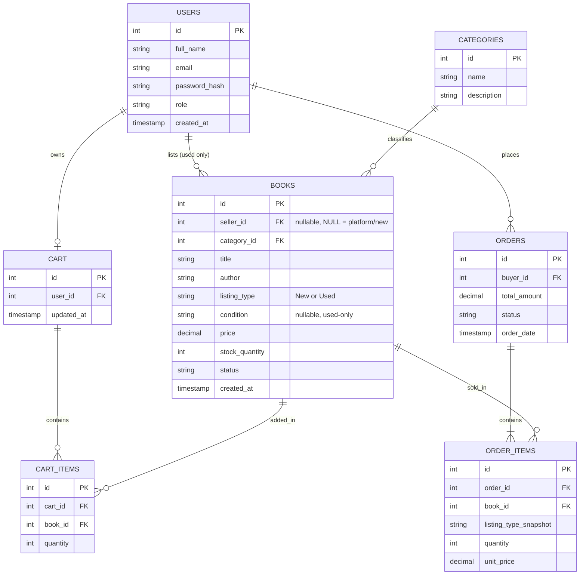

# Sprint 1: System Architecture & Scope Definition
### Project: Books Marketplace (New & Second-Hand)
### Course: E-Commerce

---

## Section 1: Target Audience & Market Focus

**Primary Persona:**
University students, school students, and general readers who want a single platform to either buy **brand-new books** (course books, latest novels, guides) directly from the platform/publishers, or buy/sell **used books** from other students at a cheaper price. The platform serves two connected user types — **Buyers** browsing both new and used listings, and **Sellers** (individual users) who list their own used books alongside the platform's official new-book catalog.

**Core Pain Point:**
Buyers currently have to use separate platforms — one for new books (e.g. an online bookstore) and another for used books (e.g. informal Facebook groups or physical secondhand markets) — with no way to compare price and condition side by side. There's no single marketplace where a student can search a book title and immediately see both a new copy and cheaper used copies, or list their own used copy for sale.

**Domain Scope:**
Books & Educational Media (Hybrid B2C + C2C E-Commerce vertical). Scope includes academic textbooks, novels, competitive exam guides, and general fiction/non-fiction. Each listing carries a **listing type** (New / Used) and, for used books, a **condition rating** (Like New, Good, Fair).

---

## Section 2: MVP Feature Scope Matrix

| Category | Feature Name | Description | Priority |
|---|---|---|---|
| Authentication | User Registration & Authentication | Password hashing and JWT-based authentication mechanism. Users register with a role (Buyer/Seller — a user can be both). | High (MVP) |
| Catalog | Book Listing & Search | Unified catalog showing both New (platform) and Used (seller) listings. Buyers can browse/search/filter by category, price, listing type (New/Used), and condition. | High (MVP) |
| Listings | Seller Listing Management | Individual sellers can add, edit, mark-as-sold, or delete their own used-book listings. New-book inventory is managed by Admin. | High (MVP) |
| Cart | Cart Management | Persistent cart management — item addition, modification, and deletion, tied to the logged-in buyer. Cart can mix new and used items. | High (MVP) |
| Checkout | Order Processing | Mock or Stripe payment gateway integration; creates an Order object. Order_Items retain listing type at time of purchase (new/used) and the seller (Admin for new, individual user for used). | High (MVP) |
| Admin | Inventory & User Moderation | Administrative CRUD operations over the platform's new-book inventory, plus the ability to moderate/remove fraudulent used-book listings. | Medium |

*(6 workflows defined — within the "4 to 6" MVP boundary required by the spec.)*

---

## Section 3: Tech Stack Selection & Justification

- **Frontend Framework:** React
  *Justification:* React's component-based architecture suits a catalog-heavy UI (book cards, filters, cart) well, and its large ecosystem (React Router, Axios) speeds up development of a CRUD-heavy marketplace app within a single semester compared to a more opinionated framework like Angular.

- **Backend Infrastructure:** Spring Boot (Java)
  *Justification:* Spring Boot's built-in support for Spring Security (JWT auth), Spring Data JPA (ORM for relational entities like Users, Orders, Books), and its mature ecosystem make it well-suited for a structured, relational e-commerce domain compared to a lighter framework like Express, which would require more manual setup for the same guarantees.

- **Database Management System:** PostgreSQL
  *Justification:* The domain is inherently relational — Users, Books, Orders, and Order_Items have strict foreign-key dependencies and require transactional integrity (e.g., an order shouldn't be created if payment fails). PostgreSQL's strong ACID compliance and native support for constraints outweighs the flexibility MongoDB would offer, since our schema doesn't need document-level flexibility.

- **Caching & Asynchronous Processing (Optional):** Redis
  *Justification:* Redis can be used to cache frequently-searched book categories/listings to reduce database load, and to store cart session data for faster read/write access than hitting PostgreSQL on every cart update.

---

## Section 4: Entity-Relationship Diagram (ERD)

### Entity Overview
- **Users** — stores both buyers and sellers (role field distinguishes them; a user can list used books *and* buy books).
- **Books** (Products) — a unified catalog table for both New and Used books. `listing_type` distinguishes them; `seller_id` is **nullable** — NULL means the book is platform-owned inventory (New), a non-null value means it's an individual seller's used listing.
- **Categories** — book genre/subject classification.
- **Cart / Cart_Items** — a buyer's active, unpurchased selections (can mix new and used items).
- **Orders / Order_Items** — finalized purchases. `Order_Items` snapshots the `listing_type` and `unit_price` at time of purchase so historical orders stay accurate even if a listing later changes.

### Relationship & Cardinality Summary
| Relationship | Cardinality |
|---|---|
| User (seller) → Books | 1:N (optional — a seller lists many *used* books; NULL for platform-owned *new* books) |
| Category → Books | 1:N (one category has many books, new or used) |
| User (buyer) → Cart | 1:1 (each buyer has one active cart) |
| Cart → Cart_Items | 1:N |
| Book → Cart_Items | 1:N (a book can sit in multiple carts before being sold) |
| User (buyer) → Orders | 1:N |
| Orders → Order_Items | 1:N |
| Book → Order_Items | 1:N (a New book can be ordered multiple times due to stock; a Used book effectively 1:1 since it's a single unique copy) |

### Mermaid ERD

---

