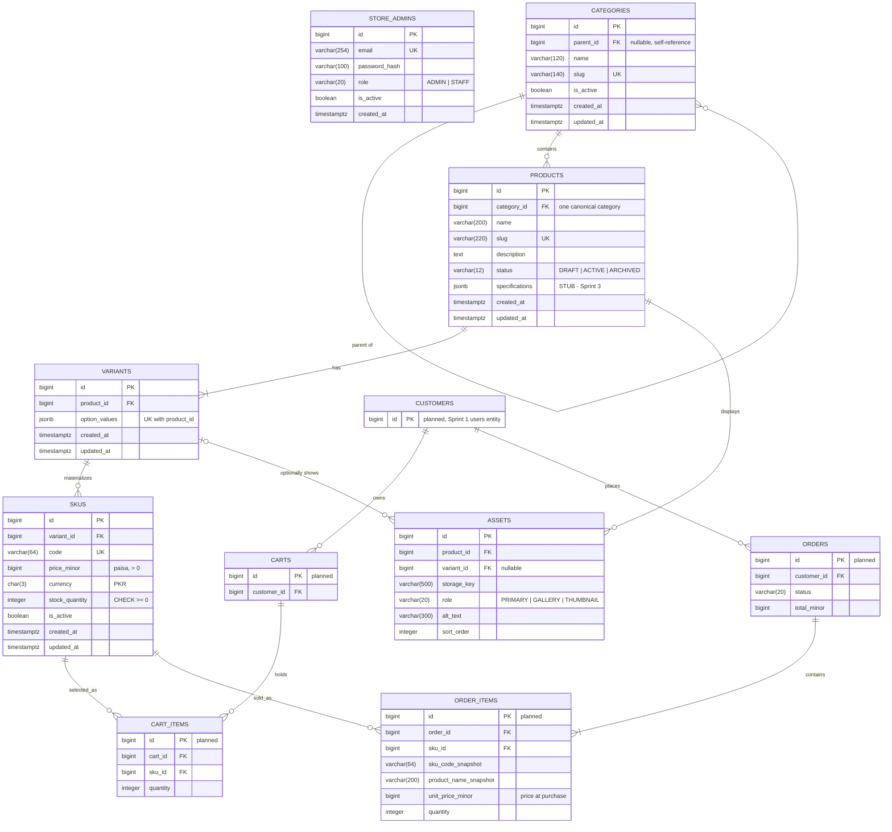

# Sprint 2: Catalog Data Foundation — Design & Documentation

**Course:** E-Commerce · University of Sindh, Jamshoro
**Project:** Dual-Path Personal Safety & Anti-Harassment App (Sindh) — *Safety Essentials Store* companion module
**Sprint length:** 15 days · **Stack:** Spring Boot · PostgreSQL · Flyway · Spring Security (JWT)

> **How the catalog fits this project.** The main product is a safety and anti-harassment app. Its commerce module is a small **Safety Essentials Store** that sells physical items users can pair with the app: personal alarms, whistles, and power banks (the app already has a low-battery alert, so a power bank is a natural companion).

---

## 1. Sprint Goal and Scope Boundary

**Goal.** Given a catalog administrator, the system must persist categories, products, variants, and SKUs without losing identity, relationship, price, or inventory meaning.

| In scope (Sprint 2) | Out of scope (Sprint 3 or later) |
|---|---|
| Category tree with stable ids and unique slugs (CAT01) | Dynamic specifications validation (column reserved, see §3.4) |
| Product create/edit with status and category (CAT02) | Asset upload and storage (table exists as a schema-only stub) |
| Variants and SKUs with unique code, price, stock (CAT03, CAT04) | Public catalog search and public read APIs |
| DB constraints, migrations, seed data (CAT05) | Publication workflow beyond a simple status guard |
| Authenticated admin API, 401/403 behaviour (CAT06) | Cart, checkout, orders, payment, shipping |
| Automated tests for rules and rejection paths | Shopper accounts |

Stubs are labelled **STUB** wherever they appear. Nothing marked STUB is claimed as Sprint 2 functionality.

---

## 2. Sprint 1 Decisions Reused or Changed

> **TODO before submission:** replace the bracketed links with your real Sprint 1 document.

| Sprint 1 decision | Status in Sprint 2 | Notes |
|---|---|---|
| Backend: Spring Boot REST API | **Reused** | Same service, new `catalog` package and `/api/v1/admin/**` routes. |
| Database: PostgreSQL, separate schemas per identity model | **Reused, extended** | Catalog lives in its own schema, `store`, with no foreign keys into safety schemas (§5.6). |
| Mobile client: Flutter / Kotlin | **Unchanged** | Not touched this sprint. The admin API is consumed via curl/Postman. |
| Encryption and offline-first scope for the safety paths | **Unchanged** | Out of scope here. The store does not handle SOS, location, or complaint data. |
| Initial ERD (Carts, Cart_Items, Orders, Order_Items) | **Changed, with reason** | `CART_ITEMS` now references **SKUS** instead of PRODUCTS (see §3.1). |
| MVP: Non-Governmental path is the hero flow | **Unchanged** | The store is a companion module and does not compete with MVP scope. |

Links: [Sprint 1 decisions](./SPRINT_1.md) · [Sprint 1 ERD](./SPRINT_1.md#erd)

---

## 3. Updated ERD and Data Dictionary

### 3.1 ER diagram

Tables marked *(planned)* are Sprint 1 entities that the catalog must connect to. They are not implemented in Sprint 2.

**Change from the Sprint 1 ERD:** Sprint 1 linked `PRODUCTS → CART_ITEMS`. A cart line must point at something that has a price and stock, and that is the **SKU**, not the product. So `CART_ITEMS` now references `SKUS`. `ORDER_ITEMS` also references `SKUS` and stores a price/name snapshot.



**Cardinality summary**

| Relationship | Cardinality | Meaning |
|---|---|---|
| Category → Category | 1 : 0..N | A category has at most one parent and any number of children. |
| Category → Product | 1 : 0..N | A product has exactly one canonical category. |
| Product → Variant | 1 : 1..N | Every product has at least one variant. A product with no options gets an automatic **default variant** with `option_values = {}`, so "zero variants" from the manual is represented by one default variant. |
| Variant → SKU | 1 : 0..N | A variant with no SKU is defined but not yet sellable. |
| Product → Asset | 1 : 0..N | STUB. |
| Variant → Asset | 0..1 : 0..N | STUB. An asset can optionally target one variant. |
| SKU → Cart_Item / Order_Item | 1 : 0..N | Planned. Sold and carted items always point at a SKU. |

### 3.2 Data dictionary

All tables live in the PostgreSQL schema **`store`**. All primary keys are `BIGINT GENERATED ALWAYS AS IDENTITY`. All timestamps are `TIMESTAMPTZ NOT NULL DEFAULT now()`.

**`store.categories`**

| Column | Type | Null | Rules |
|---|---|---|---|
| id | bigint | no | PK |
| parent_id | bigint | yes | FK → categories(id); `CHECK (parent_id IS NULL OR parent_id <> id)`; cycle trigger (§5.2) |
| name | varchar(120) | no | not blank |
| slug | varchar(140) | no | `UNIQUE`; format `^[a-z0-9]+(-[a-z0-9]+)*$` |
| is_active | boolean | no | default `true` |
| created_at, updated_at | timestamptz | no | |

**`store.products`**

| Column | Type | Null | Rules |
|---|---|---|---|
| id | bigint | no | PK |
| category_id | bigint | no | FK → categories(id) |
| name | varchar(200) | no | not blank |
| slug | varchar(220) | no | `UNIQUE`; same format as category slug |
| description | text | yes | |
| status | varchar(12) | no | `CHECK IN ('DRAFT','ACTIVE','ARCHIVED')`, default `DRAFT` |
| specifications | jsonb | no | default `'{}'`; `CHECK (jsonb_typeof(specifications) = 'object')`. **STUB** (§3.4) |
| created_at, updated_at | timestamptz | no | |

**`store.variants`**

| Column | Type | Null | Rules |
|---|---|---|---|
| id | bigint | no | PK |
| product_id | bigint | no | FK → products(id) |
| option_values | jsonb | no | `CHECK (jsonb_typeof(option_values) = 'object')`; **`UNIQUE (product_id, option_values)`** |
| created_at, updated_at | timestamptz | no | |

**`store.skus`**

| Column | Type | Null | Rules |
|---|---|---|---|
| id | bigint | no | PK |
| variant_id | bigint | no | FK → variants(id) |
| code | varchar(64) | no | `UNIQUE`; stored upper-case; format `^[A-Z0-9]+(-[A-Z0-9]+)*$` |
| price_minor | bigint | no | `CHECK (price_minor > 0)`. Integer **paisa** (1 PKR = 100 paisa). No floating point anywhere. |
| currency | char(3) | no | default `'PKR'`, `CHECK (currency = 'PKR')` for now |
| stock_quantity | integer | no | default `0`, **`CHECK (stock_quantity >= 0)`** |
| is_active | boolean | no | default `true` |
| created_at, updated_at | timestamptz | no | |

**`store.assets` — STUB (schema only, no API or upload in Sprint 2).** Columns as in the diagram. `role` is `CHECK IN ('PRIMARY','GALLERY','THUMBNAIL')`, `alt_text` is required for `PRIMARY`, and `UNIQUE (product_id, sort_order)`.

**`store.store_admins`.** Email is unique and case-insensitive (`UNIQUE (lower(email))`). `password_hash` is a BCrypt hash (cost 12). Roles are `ADMIN` or `STAFF`; only `ADMIN` may call `/api/v1/admin/**`.

### 3.3 Foreign-key delete / update policies

Primary keys are identity columns and never change, so every FK uses `ON UPDATE RESTRICT`.

| Foreign key | ON DELETE | Reason |
|---|---|---|
| categories.parent_id → categories | **RESTRICT** | Categories are deactivated, never hard-deleted. A parent with children cannot be removed. |
| products.category_id → categories | **RESTRICT** | Prevents orphaned products. |
| variants.product_id → products | **CASCADE** | A variant has no meaning without its product. A product with any SKU can't be deleted anyway, because `skus.variant_id` is RESTRICT and blocks the cascade. |
| skus.variant_id → variants | **RESTRICT** | A SKU is a sellable identity that carts and orders will point to. It must never vanish silently. |
| assets.product_id → products | CASCADE | Assets are dependent data. |
| assets.variant_id → variants | SET NULL | The asset falls back to a product-level image. |
| cart_items.cart_id → carts *(planned)* | CASCADE | Cart lines die with the cart. |
| cart_items.sku_id → skus *(planned)* | RESTRICT | Deactivate instead of deleting. |
| order_items.order_id → orders *(planned)* | RESTRICT | Order history is never cascaded away. |
| order_items.sku_id → skus *(planned)* | RESTRICT | Same, plus a name/code/price snapshot on the row. |

### 3.4 Specification decision (STUB)

We chose **validated JSONB on `products.specifications`** instead of EAV tables. Specs are read together with the product, they are not queried relationally in the MVP, and JSONB avoids extra joins on low-end deployments.

- **Sprint 2 enforcement:** the column exists, defaults to `{}`, and a DB check requires it to be a JSON object. The admin API does **not** expose it yet.
- **Written validation rule (implemented in Sprint 3):** at most 30 keys; keys are `snake_case`, at most 50 characters; values are string, number or boolean only (no nesting), and strings are at most 200 characters.

---

## 4. Administration Route Table

Base path `/api/v1`. All `/admin/**` routes require `Authorization: Bearer <JWT>` with role `ADMIN`. Requests and responses are JSON (`snake_case` fields). Money is always `price_minor` (integer paisa).

### 4.1 Route summary

| Method | Route | Purpose | Required? |
|---|---|---|---|
| POST | `/auth/admin/login` | Exchange credentials for a JWT | Added (needed for auth) |
| POST | `/admin/categories` | Create a category | Baseline |
| GET | `/admin/categories` | Return the category tree | Baseline |
| PATCH | `/admin/categories/:id` | Rename, re-parent, activate or deactivate | Added (CAT01) |
| POST | `/admin/products` | Create a draft product | Baseline |
| GET | `/admin/products` | List products (`?status=&category_id=&page=&size=`) | Baseline |
| GET | `/admin/products/:id` | One product with its variants and SKUs | Added |
| PATCH | `/admin/products/:id` | Update content, category or status | Baseline |
| DELETE | `/admin/products/:id` | Hard-delete a **DRAFT** product with no SKUs | Added (CRUD) |
| POST | `/admin/products/:id/variants` | Add a valid option combination | Added (demo needs it) |
| POST | `/admin/products/:id/skus` | Add a validated SKU | Baseline |
| PATCH | `/admin/skus/:id` | Update price, stock or active status | Baseline |

### 4.2 Common error envelope

Every error uses the same shape. No stack traces or SQL are ever returned.

```json
{
  "error": {
    "code": "DUPLICATE_SKU_CODE",
    "message": "A SKU with code 'SA-ALARM-RED' already exists.",
    "details": [ { "field": "code", "issue": "must be unique" } ]
  }
}
```

| HTTP | `error.code` | When |
|---|---|---|
| 400 | `VALIDATION_ERROR` / `MALFORMED_JSON` | Missing or wrong-typed field, bad slug format, `stock_quantity < 0`, `price_minor <= 0` |
| 401 | `UNAUTHENTICATED` | Missing, invalid, or expired token |
| 403 | `FORBIDDEN` | Valid token, role is not `ADMIN` |
| 404 | `NOT_FOUND` | Unknown id |
| 409 | `DUPLICATE_SLUG`, `DUPLICATE_SKU_CODE`, `DUPLICATE_VARIANT` | Unique constraint hit |
| 409 | `HAS_DEPENDENTS` | Deleting a product that has SKUs (archive it instead) |
| 422 | `CATEGORY_CYCLE`, `PARENT_INACTIVE`, `CATEGORY_INACTIVE`, `OPTION_KEYS_MISMATCH`, `VARIANT_PRODUCT_MISMATCH`, `PRODUCT_HAS_NO_ACTIVE_SKU` | Business-rule violation |

### 4.3 Endpoint contracts

#### `POST /auth/admin/login` — public
Request: `{ "email": string, "password": string }`
Response `200`: `{ "access_token": string, "token_type": "Bearer", "expires_in": 3600 }`
Errors: `400` validation, `401` bad credentials (same message for unknown email and wrong password).

#### `POST /admin/categories`
| Field | Type | Required | Rule |
|---|---|---|---|
| name | string | yes | 1–120 chars |
| slug | string | yes | unique, slug format |
| parent_id | integer | no | must exist and be active |

Response `201`:
```json
{ "id": 2, "parent_id": 1, "name": "Alarms & Whistles", "slug": "alarms-whistles",
  "is_active": true, "created_at": "2026-10-01T09:00:00Z", "updated_at": "2026-10-01T09:00:00Z" }
```
Errors: `400`, `401`, `403`, `404` (parent missing), `409 DUPLICATE_SLUG`, `422 PARENT_INACTIVE`.

#### `GET /admin/categories`
Response `200`: nested tree, roots first, children sorted by name.
```json
{ "data": [
  { "id": 1, "name": "Safety Devices", "slug": "safety-devices", "is_active": true,
    "children": [
      { "id": 2, "name": "Alarms & Whistles", "slug": "alarms-whistles", "is_active": true, "children": [] },
      { "id": 3, "name": "Power & Connectivity", "slug": "power-connectivity", "is_active": true, "children": [] }
    ] }
] }
```
Includes inactive categories, which are flagged with `is_active: false`.

#### `PATCH /admin/categories/:id`
Any of `name`, `slug`, `parent_id` (`null` moves to root), `is_active`.
Response `200`: the updated category. Errors: `409 DUPLICATE_SLUG`, `422 CATEGORY_CYCLE`, `422 PARENT_INACTIVE`.
Setting `is_active=false` also deactivates the whole subtree (§5.3).

#### `POST /admin/products`
| Field | Type | Required | Rule |
|---|---|---|---|
| name | string | yes | 1–200 chars |
| slug | string | yes | unique |
| category_id | integer | yes | must exist and be active |
| description | string | no | |

Always created as `DRAFT`. The server also creates the product's default variant. Response `201`:
```json
{ "id": 4, "category_id": 2, "name": "Personal Safety Alarm Keychain", "slug": "personal-safety-alarm-keychain",
  "description": "110 dB alarm with pull-pin.", "status": "DRAFT",
  "created_at": "2026-10-01T09:05:00Z", "updated_at": "2026-10-01T09:05:00Z" }
```
Errors: `400`, `404` (category), `409 DUPLICATE_SLUG`, `422 CATEGORY_INACTIVE`.

#### `GET /admin/products`
Query: `status`, `category_id`, `page` (default 0), `size` (default 20, max 100).
Response `200`: `{ "data": [ product, ... ], "page": { "number": 0, "size": 20, "total_elements": 4 } }`. Each item includes `sku_count` and `active_sku_count`.

#### `GET /admin/products/:id`
Response `200`: the product plus `variants[]`, each with `option_values` and `skus[]`. Each SKU includes the derived `availability` field (§5.3, Q4). Error: `404`.

#### `PATCH /admin/products/:id`
Any of `name`, `slug`, `description`, `category_id`, `status`. Response `200`. Errors: `409 DUPLICATE_SLUG`, `422 CATEGORY_INACTIVE`, **`422 PRODUCT_HAS_NO_ACTIVE_SKU`** when setting `status=ACTIVE` with no active SKU.

#### `DELETE /admin/products/:id`
Only for `DRAFT` products with zero SKUs. Response `204`. Errors: `404`, `409 HAS_DEPENDENTS`.

#### `POST /admin/products/:id/variants`
| Field | Type | Required | Rule |
|---|---|---|---|
| option_values | object of string → string | yes | non-empty; keys must match the key set of the product's existing variants; unique per product |

Request: `{ "option_values": { "color": "Black", "capacity": "20000mAh" } }`
Response `201`: `{ "id": 9, "product_id": 5, "option_values": { "color": "Black", "capacity": "20000mAh" } }`
Errors: `409 DUPLICATE_VARIANT`, `422 OPTION_KEYS_MISMATCH`.
Combinations that are **not offered are simply never created** (CAT04).

#### `POST /admin/products/:id/skus`
| Field | Type | Required | Rule |
|---|---|---|---|
| variant_id | integer | conditional | required when the product has more than one variant; must belong to `:id` |
| code | string | yes | unique, upper-cased by the server, SKU format |
| price_minor | integer | yes | `> 0` |
| stock_quantity | integer | no (default 0) | `>= 0` |
| is_active | boolean | no (default true) | |

Request: `{ "variant_id": 7, "code": "sa-alarm-red", "price_minor": 120000, "stock_quantity": 40 }`
Response `201`:
```json
{ "id": 11, "variant_id": 7, "code": "SA-ALARM-RED", "price_minor": 120000, "currency": "PKR",
  "stock_quantity": 40, "is_active": true, "availability": "IN_STOCK" }
```
Errors: `400`, `404`, `409 DUPLICATE_SKU_CODE`, `422 VARIANT_PRODUCT_MISMATCH`.

#### `PATCH /admin/skus/:id`
Any of `price_minor`, `stock_quantity`, `is_active`. Response `200`: the SKU. Errors: `400` (negative stock or non-positive price), `404`. The code and variant of a SKU are immutable.

**Example error (duplicate SKU):**
```http
POST /api/v1/admin/products/4/skus     → 409 Conflict
{ "error": { "code": "DUPLICATE_SKU_CODE",
             "message": "A SKU with code 'SA-ALARM-RED' already exists.",
             "details": [ { "field": "code", "issue": "must be unique" } ] } }
```

---

## 5. Data Integrity and Authorization Decisions

### 5.1 Layered enforcement (CAT05)

Each rule is enforced in three places. **The database is the source of truth**, and the API layers exist for friendly messages.

| Rule | Bean validation (400) | Service check (409/422) | Database (last line of defence) |
|---|---|---|---|
| Unique category slug | format | pre-check | `uq_categories_slug` |
| Unique product slug | format | pre-check | `uq_products_slug` |
| Unique SKU code | format, upper-case | pre-check | `uq_skus_code` |
| Unique variant per product | non-empty object | pre-check | `uq_variants_product_options` |
| No negative stock | `@PositiveOrZero` | reject update | `chk_skus_stock_non_negative` |
| Positive integer price | `@Positive`, integer type | — | `chk_skus_price_positive` |
| Valid status | enum | — | `chk_products_status` |
| No self-parent | — | reject | `chk_categories_no_self_parent` |
| No category cycles | — | ancestor walk | `trg_categories_no_cycle` |
| Referential integrity | — | 404 on missing ids | all FKs in §3.3 |

Because a check-then-insert race is possible, the service **also catches `DataIntegrityViolationException`**, reads the violated constraint name, and maps it to the same `409`/`422` codes. This is why a duplicate never becomes a raw `500` or traceback.

### 5.2 Cycle prevention

A category cannot become its own ancestor. The service walks up from the proposed parent, and a `BEFORE INSERT OR UPDATE OF parent_id` trigger repeats the check inside the database:

```sql
CREATE OR REPLACE FUNCTION store.prevent_category_cycle() RETURNS trigger AS $$
BEGIN
  IF NEW.parent_id IS NULL THEN RETURN NEW; END IF;
  PERFORM pg_advisory_xact_lock(hashtext('store.categories.tree'));  -- serialise concurrent re-parenting
  IF NEW.parent_id = NEW.id THEN
    RAISE EXCEPTION 'category_cycle: a category cannot be its own parent' USING ERRCODE = '23514';
  END IF;
  IF EXISTS (
    WITH RECURSIVE ancestors(id, parent_id) AS (
      SELECT id, parent_id FROM store.categories WHERE id = NEW.parent_id
      UNION
      SELECT c.id, c.parent_id FROM store.categories c JOIN ancestors a ON c.id = a.parent_id
    )
    SELECT 1 FROM ancestors WHERE id = NEW.id
  ) THEN
    RAISE EXCEPTION 'category_cycle: parent is a descendant of this category' USING ERRCODE = '23514';
  END IF;
  RETURN NEW;
END $$ LANGUAGE plpgsql;

CREATE TRIGGER trg_categories_no_cycle
BEFORE INSERT OR UPDATE OF parent_id ON store.categories
FOR EACH ROW EXECUTE FUNCTION store.prevent_category_cycle();
```

### 5.3 Business-rule decisions (manual §8, Q1–Q7)

**Q1. Can a draft product have no SKU? Can a published product have no sellable SKU?**
A `DRAFT` product may have zero SKUs. The seed product *Workplace Safety Awareness Kit* is one. Moving a product to `ACTIVE` requires **at least one active SKU**, otherwise `422 PRODUCT_HAS_NO_ACTIVE_SKU`. "Sellable" means the SKU is `is_active`; stock may be 0, in which case it is shown as out of stock. Richer publication rules are Sprint 3.

**Q2. One canonical category, many, or both?**
**One canonical category** (`products.category_id NOT NULL`). This keeps breadcrumbs, URLs and reporting unambiguous, and the manual asks for a category assignment rather than a taxonomy. Cross-listing (for example "Gift ideas") will be added in Sprint 3 as a separate `collections` join table, so a product keeps one canonical home plus optional extra collections.

**Q3. What happens when a parent category is deactivated?**
The **whole subtree is deactivated in the same transaction** (recursive update). Products in those categories keep their own status but are excluded from future public reads. Reactivation is **not** automatic, so an admin must reactivate each child on purpose. Reactivating a child under an inactive parent is rejected with `422 PARENT_INACTIVE`. Assigning a product to an inactive category is rejected with `422 CATEGORY_INACTIVE`.
*Example:* deactivating `safety-devices` also deactivates `alarms-whistles` and `power-connectivity`.

**Q4. How is an out-of-stock SKU represented in a public response?**
Through a derived, never stored, `availability` field.

| Condition | `availability` |
|---|---|
| `is_active` and `stock_quantity > 0` | `IN_STOCK` |
| `is_active` and `stock_quantity = 0` | `OUT_OF_STOCK` (still listed, cannot be added to a cart) |
| not `is_active` | `UNAVAILABLE` (hidden from public reads) |

*Example:* the 20000 mAh black power bank (`SA-PBANK-BLK-20K`) has stock 0 and returns `OUT_OF_STOCK`. The public projection exposes only this label, never the raw stock number.

**Q5. Can two SKUs share a price? Can a SKU have a price override?**
Yes, two SKUs can share a price: there is no uniqueness on price. `SA-ALARM-RED` and `SA-ALARM-BLK` are both PKR 1,200. The **SKU's `price_minor` is the only price**, so there is no product-level price to override. Each SKU simply carries its own. A `compare_at_price` (sale price) is deferred.

**Q6. What prevents negative stock and duplicate SKU codes?**
Three layers (§5.1). Stock has `@PositiveOrZero`, a service rejection, and `CHECK (stock_quantity >= 0)`. Codes have format validation, a pre-check, and `UNIQUE (code)`. Stock updates in this sprint set an absolute value. Later cart/checkout work must decrement atomically with `UPDATE … SET stock_quantity = stock_quantity - :n WHERE id = :id AND stock_quantity >= :n`, so the CHECK constraint also protects against overselling races.

**Q7. What happens to a product referenced by a future cart or order after it is deactivated?**
Nothing is deleted. `cart_items.sku_id` and `order_items.sku_id` are `RESTRICT`, so referenced SKUs and products cannot be hard-deleted. Deactivation or archiving sets `is_active = false` or `status = ARCHIVED`. Open carts will show the line as unavailable. Orders keep an **immutable snapshot** (`sku_code_snapshot`, `product_name_snapshot`, `unit_price_minor`), so past orders never change when the catalog does.

### 5.4 Variant and SKU model (CAT03, CAT04)

- A **product** is the marketing identity, a **variant** is a valid option combination, and a **SKU** is the sellable, priced, stock-counted unit.
- Products with no options get one default variant (`{}`), so every SKU always has a `variant_id`.
- All variants of one product must use the same option keys. Mixing `{color}` and `{size}` is rejected with `422 OPTION_KEYS_MISMATCH`. This cross-row rule is enforced in the service and tested, because a plain constraint cannot express it.
- An unavailable combination has **no row**. We never create a fake or zero-stock SKU for it.

### 5.5 Authentication and authorization (CAT06)

- Stateless **JWT** (HS256, 60-minute expiry) issued by `/auth/admin/login`. The signing secret comes from the environment.
- Spring Security is **secure by default**: `/auth/admin/login` is public, `/api/v1/admin/**` requires `ROLE_ADMIN`, and every other route is denied.
- A custom `AuthenticationEntryPoint` returns `401 UNAUTHENTICATED` and a custom `AccessDeniedHandler` returns `403 FORBIDDEN`, both in the common error envelope.
- Passwords are hashed with BCrypt (cost 12). The first admin is created by the seed command from environment variables. **No default credentials exist in the repository.**

### 5.6 Isolation from the safety app's identity systems

The safety app keeps its identity models structurally separate (Governmental account, anonymous SOS session, pseudonymous community ID). The store follows the same principle:

- Store tables live in their own schema, `store`, with **no foreign keys** to any safety-app table.
- The catalog holds no location, contact, SOS, or complaint data.
- Future shopper accounts (`CUSTOMERS`) will be a **separate identity** and will not reuse the Governmental CNIC/OTP account or the anonymous device ID. Buying a personal alarm must never reveal that someone also uses the app.

---

## 6. Seed Data and Demonstration Instructions

### 6.1 Local setup

Requirements: JDK 21, Docker (for PostgreSQL and the Testcontainers tests), Git.

```bash
git clone <team-repo-url> && cd <repo>
cp .env.example .env          # then edit the values; .env is git-ignored
docker compose up -d db       # PostgreSQL 16
./mvnw spring-boot:run        # Flyway migrations run automatically on start
```

| Variable | Purpose | Example (do not commit real values) |
|---|---|---|
| `DB_URL` | JDBC URL | `jdbc:postgresql://localhost:5432/safety_store` |
| `DB_USER`, `DB_PASSWORD` | Database credentials | *(local only)* |
| `JWT_SECRET` | HS256 signing key, at least 32 random bytes | *(generate locally)* |
| `SEED_ADMIN_EMAIL`, `SEED_ADMIN_PASSWORD` | First admin created by the seeder | *(local only)* |

### 6.2 Seed command

```bash
./mvnw spring-boot:run -Dspring-boot.run.profiles=seed
```

The seeder is **idempotent** (it upserts on slug and SKU code). Running it on a clean database always produces the same dataset.

| Category tree | |
|---|---|
| `safety-devices` (root) | → `alarms-whistles`, → `power-connectivity` |
| `awareness-kits` (root) | |

| Product | Category | Status | Variants | SKUs (price, stock) |
|---|---|---|---|---|
| Personal Safety Alarm Keychain | alarms-whistles | ACTIVE | Color: Red, Black | `SA-ALARM-RED` (PKR 1,200, 40) · `SA-ALARM-BLK` (PKR 1,200, 25) |
| Portable Power Bank | power-connectivity | ACTIVE | Color × Capacity: Black/10000, White/10000, Black/20000 | `SA-PBANK-BLK-10K` (PKR 3,500, 15) · `SA-PBANK-WHT-10K` (PKR 3,500, 10) · `SA-PBANK-BLK-20K` (PKR 5,800, **0**) |
| Emergency Whistle | alarms-whistles | ACTIVE | default variant | `SA-WHISTLE-STD` (PKR 250, 100) |
| Workplace Safety Awareness Kit | awareness-kits | DRAFT | default variant | none (demonstrates Q1) |

Totals: **2 tree levels, 4 products, 6 SKUs**.
**Intentionally unavailable combination:** *White / 20000 mAh* power bank. No variant row exists for it, and the seed asserts that. One SKU is deliberately out of stock (`SA-PBANK-BLK-20K`).

### 6.3 Demonstration: admin creates category → product → variant → SKU → reads them back

> **TODO before submission:** run these commands yourself and **replace the sample responses with your real output**. Redact tokens and private URLs.

```bash
BASE=http://localhost:8080/api/v1

# 0. Login
curl -s -X POST $BASE/auth/admin/login -H 'Content-Type: application/json' \
  -d '{"email":"'"$SEED_ADMIN_EMAIL"'","password":"'"$SEED_ADMIN_PASSWORD"'"}'
# → { "access_token": "<REDACTED>", "token_type": "Bearer", "expires_in": 3600 }
TOKEN=<paste token>
AUTH="Authorization: Bearer $TOKEN"; JSON='Content-Type: application/json'

# 1. Category
curl -s -X POST $BASE/admin/categories -H "$AUTH" -H "$JSON" \
  -d '{"name":"Travel Safety","slug":"travel-safety"}'
# → 201 { "id": 6, "parent_id": null, "name": "Travel Safety", "slug": "travel-safety", "is_active": true, ... }

# 2. Product (draft)
curl -s -X POST $BASE/admin/products -H "$AUTH" -H "$JSON" \
  -d '{"name":"Door Stopper Alarm","slug":"door-stopper-alarm","category_id":6}'
# → 201 { "id": 5, "status": "DRAFT", "category_id": 6, ... }

# 3. Variant
curl -s -X POST $BASE/admin/products/5/variants -H "$AUTH" -H "$JSON" \
  -d '{"option_values":{"color":"Black"}}'
# → 201 { "id": 12, "product_id": 5, "option_values": { "color": "Black" } }

# 4. SKU
curl -s -X POST $BASE/admin/products/5/skus -H "$AUTH" -H "$JSON" \
  -d '{"variant_id":12,"code":"SA-DOORALM-BLK","price_minor":180000,"stock_quantity":20}'
# → 201 { "id": 20, "code": "SA-DOORALM-BLK", "price_minor": 180000, "currency": "PKR", "availability": "IN_STOCK", ... }

# 5. Read back
curl -s $BASE/admin/products/5 -H "$AUTH"
curl -s "$BASE/admin/products?status=DRAFT" -H "$AUTH"
curl -s $BASE/admin/categories -H "$AUTH"

# 6. Rejection paths
curl -i -X POST $BASE/admin/categories -H "$JSON" -d '{"name":"x","slug":"x"}'                # → 401
curl -i -X POST $BASE/admin/products/5/skus -H "$AUTH" -H "$JSON" \
  -d '{"variant_id":12,"code":"SA-DOORALM-BLK","price_minor":1}'                              # → 409 DUPLICATE_SKU_CODE
curl -i -X PATCH $BASE/admin/skus/20 -H "$AUTH" -H "$JSON" -d '{"stock_quantity":-5}'          # → 400 VALIDATION_ERROR
```

---

## 7. Test Strategy, Command, and Result

**Approach.** JUnit 5 with MockMvc for the API and **Testcontainers (PostgreSQL 16)** for repository and constraint tests. H2 is not used, because triggers, `CHECK` constraints and JSONB uniqueness must be tested against real PostgreSQL.

**Command:** `./mvnw test` (requires Docker running)

| ID | Rule | Test (success or rejection) | Expected |
|---|---|---|---|
| T-01 | CAT02 | Create product with all required fields | 201, status `DRAFT` |
| T-02 | CAT02 | Create product with missing name | 400 `VALIDATION_ERROR` |
| T-03 | CAT05 | Duplicate product slug | 409 `DUPLICATE_SLUG` |
| T-04 | CAT05 | Duplicate category slug | 409 `DUPLICATE_SLUG` |
| T-05 | CAT03 | Create SKU with required fields | 201 |
| T-06 | CAT05 | Duplicate SKU code, including different letter case | 409 `DUPLICATE_SKU_CODE` |
| T-07 | CAT05 | Direct SQL insert of a duplicate code (bypassing the API) | `DataIntegrityViolationException` from `uq_skus_code` |
| T-08 | CAT01 | Category cannot be its own parent | 422 `CATEGORY_CYCLE` |
| T-09 | CAT01 | A → B → C, then set A's parent to C | 422 `CATEGORY_CYCLE` |
| T-10 | CAT01 | Same cycle via direct SQL | trigger error `23514` |
| T-11 | Q3 | Deactivating a parent deactivates the subtree | children `is_active = false` |
| T-12 | Q3 | Reactivating a child under an inactive parent | 422 `PARENT_INACTIVE` |
| T-13 | CAT05 | Negative stock through PATCH | 400 `VALIDATION_ERROR` |
| T-14 | CAT05 | Negative stock through direct SQL | `chk_skus_stock_non_negative` violation |
| T-15 | CAT05 | Price `0` or a decimal value | 400 |
| T-16 | CAT04 | Duplicate option combination on one product | 409 `DUPLICATE_VARIANT` |
| T-17 | CAT04 | Variant with different option keys from its siblings | 422 `OPTION_KEYS_MISMATCH` |
| T-18 | CAT04 | Seed check: *White / 20000* has no variant row and no SKU | assertion passes |
| T-19 | CAT03 | SKU whose `variant_id` belongs to another product | 422 `VARIANT_PRODUCT_MISMATCH` |
| T-20 | Q1 | Activate a product with no active SKU | 422 `PRODUCT_HAS_NO_ACTIVE_SKU` |
| T-21 | Q1 | Draft product with zero SKUs is allowed | 201 |
| T-22 | Q5 | Two SKUs with the same price are allowed | 201 for both |
| T-23 | CAT06 | Every admin write route with no token | 401 |
| T-24 | CAT06 | Every admin route with a valid `STAFF` token | 403 |
| T-25 | CAT06 | Admin route with an expired or tampered token | 401 |
| T-26 | Q7 | Delete a product that has SKUs | 409 `HAS_DEPENDENTS` |
| T-27 | Q4 | `availability` derivation for the three states | `IN_STOCK` / `OUT_OF_STOCK` / `UNAVAILABLE` |
| T-28 | Seed | Running the seeder twice leaves identical row counts | passes |

**Result.**

> **TODO before submission:** paste your real output here and update the counts. Do not submit this section unedited.

```
$ ./mvnw test
...
[INFO] Tests run: __, Failures: 0, Errors: 0, Skipped: 0
[INFO] BUILD SUCCESS
```

---

## 8. Known Limitations and Sprint 3 Backlog

### Known limitations
- **Specifications and assets are stubs.** The columns and tables exist, but there is no validation, API, or file storage yet.
- The rule "all variants of a product share the same option keys" lives in the service (and its tests), not in a database constraint.
- Stock updates set an absolute value. Concurrent admin edits are last-write-wins. Atomic decrement arrives with cart/checkout.
- Only one currency (PKR) is supported.
- No login rate-limiting or refresh tokens. A single 60-minute token is used.
- Admin CRUD has no audit log yet (who changed which price).
- Categories are deactivated, never deleted. There is no "restore subtree" shortcut.

### Sprint 3 backlog (what can safely build on this foundation)
1. **Dynamic specifications:** implement the §3.4 validation rule and expose the field.
2. **Assets:** upload, storage key handling, and `PRIMARY`/`GALLERY` roles on the existing `assets` table.
3. **Public catalog reads:** projections that respect `is_active`, category activity and `availability` (§5.3), plus search and filtering.
4. **Publication rules:** extend the `ACTIVE` guard (required content, at least one asset, and so on).
5. **Collections:** the many-to-many cross-listing from Q2.
6. **Catalog-to-cart readiness:** `CUSTOMERS`, `CARTS`, `CART_ITEMS` pointing at `skus.id`, atomic stock decrement, and order snapshot columns.
7. **Audit log** for price and stock changes.

**Hand-off contract.** Sprint 3 must consume `store.skus.id` as the only purchasable identity and must read prices from `skus.price_minor`. It must not duplicate product or pricing logic, and it must not add any link between store tables and the safety-app identity schemas.

---

## Appendix A. Requirement Traceability

| Requirement | Where addressed | Proven by |
|---|---|---|
| CAT01 Categories | §3.2, §4.3 (categories), §5.2, §5.3 Q3 | T-04, T-08–T-12 |
| CAT02 Product identity | §3.2, §4.3 (products) | T-01–T-03 |
| CAT03 Variants & SKUs | §3.2, §4.3 (variants/skus), §5.4 | T-05, T-06, T-19, T-22 |
| CAT04 Variant combinations | §5.4, §6.2 (White/20000) | T-16–T-18 |
| CAT05 Data integrity | §3.3, §5.1 | T-03, T-04, T-07, T-10, T-14, T-15 |
| CAT06 Administrative access | §5.5, §4.2 | T-23–T-25 |

## Appendix B. Sprint Review Checklist

- [ ] A reviewer can tell product, variant and SKU apart in the DB and in `GET /admin/products/:id`.
- [ ] Money, stock, slugs and SKU codes are protected by database constraints (§5.1).
- [ ] The seed command reproduces the demo on a clean database (T-28).
- [ ] Every major business rule has at least one automated failure-path test (§7).
- [ ] This document explains what Sprint 3 can safely build on (§8).
- [ ] No secrets committed; `.env.example` present; `.env` is git-ignored.
